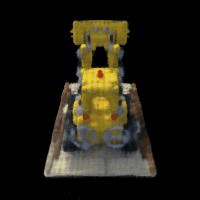
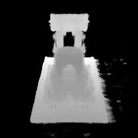

# NeRF from scratch (CS180 Project)

I trained a NeRF entirely from scratch. The data can be found [here](https://inst.eecs.berkeley.edu/~cs180/fa23/hw/proj5/assets/lego_200x200.npz). [Here](https://inst.eecs.berkeley.edu/~cs180/fa23/hw/proj5/) was the spec for the project. 

Here's the result:

    

      
      
RGB

    

    

      
      
Depth

    

